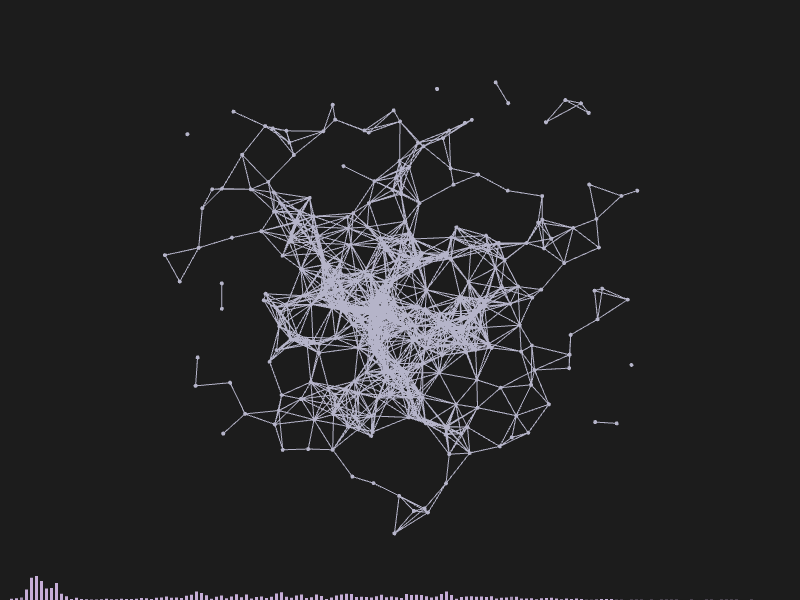

# Dancing Clouds

Audio reactive visual project. We play a music track, get it's spectrum, and use
it to control a point cloud.

This is a work in progress, bugs are to be expected, also I deviated the Object
Oriented flow sometimes.

### Preview



The dancing clouds example from the Mastering Openframeworks Book.

I made a few subtle changes like, like using the newer function names and
passing the song/sound track as the first argument.

### Build and Run

```sh
# clone this repo in to OF_PATH/apps/myApps/

$ make

$ ./bin/dancingCloud path/to/your/audio/file_or_folder
```
